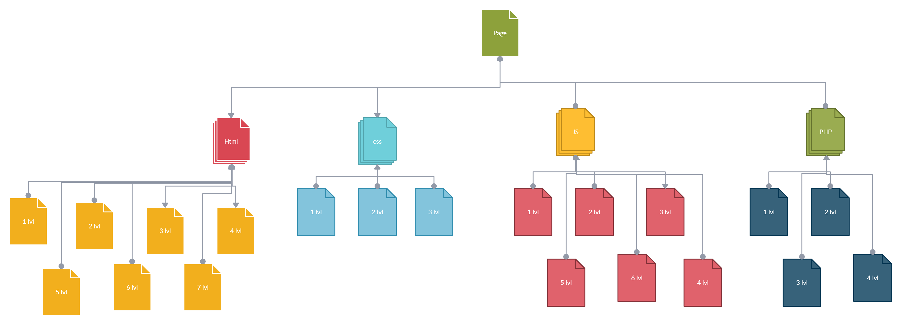

# Newbie's Clash - Quiz Game
`this is an old project i made in december of 2021 by following the` [Brackeys](https://www.youtube.com/@Brackeys) ` tutorials`  
A Unity-based educational quiz game designed to help beginners learn web development fundamentals through interactive true/false questions. The project follows the "Quiz Game" tutorial by Brackeys on YouTube, with custom extensions for multiple programming languages and educational pathways.


---

## Table of Contents

- [Project Overview](#project-overview)
- [System Architecture](#system-architecture)
- [Core Components](#core-components)
- [Game Mechanics](#game-mechanics)
- [Scene Structure](#scene-structure)
- [User Interface](#user-interface)
- [Installation & Setup](#installation--setup)
- [Code Documentation](#code-documentation)
- [Features](#features)
- [Known Issues](#known-issues)

---

## Project Overview

**Newbie's Clash** is an interactive quiz game application built in Unity that teaches web development concepts (HTML, CSS, JavaScript, PHP) through a gamified true/false quiz format. The game features multiple levels, animated UI feedback, and persistent game state management.

### Key Characteristics
- **Engine**: Unity (2D)
- **Language**: C#
- **Tutorial Foundation**: Brackeys "Quiz Game" Tutorial
- **Target Audience**: Beginners learning web development
- **Educational Topics**: HTML, CSS, JavaScript, PHP
- **Game Type**: True/False Quiz


---

## System Architecture

The project uses a **decoupled, state-preserving architecture** that relies on:

### Core Design Pattern: Game Manager Pattern

A single persistent orchestrator (`GameManager`) drives the entire gameplay loop:
- Manages game state progression
- Handles random question selection
- Evaluates user responses
- Controls scene transitions
- Preserves quiz data across scene reloads

### State Persistence Strategy

```
Static Memory Allocation
    ↓
Data persists across scene reloads
    ↓
Prevents data loss during Unity lifecycle
    ↓
No dependency on traditional GameObject destruction
```

The architecture decouples data serialization from Unity's standard MonoBehaviour destruction using static memory allocations, ensuring quiz progress isn't lost between scenes.


---

## Core Components

### 1. **Question.cs**
A lightweight, serializable data container class.

```csharp
[System.Serializable]
public class Question {
    public string fact;      // Quiz question text
    public bool isTrue;      // Correct answer (true/false)
}
```

**Purpose**: Stores individual quiz parameters for easy editing in the Unity Inspector.

**Attributes**:
- `[System.Serializable]`: Exposes nested properties directly in Unity Inspector
- `fact`: The statement/question presented to the player
- `isTrue`: Boolean indicating whether the statement is correct

---

### 2. **GameManager.cs**
The main orchestrator and game engine controller.

```csharp
public class GameManager : MonoBehaviour
```

**Responsibilities**:
- Initialize and manage the quiz database
- Track answered vs. unanswered questions
- Display current questions
- Evaluate user responses
- Control scene transitions
- Trigger animations on user input

**Key Fields**:
- `public Question[] questions`: Master array of all quiz questions (configured in Inspector)
- `private static List<Question> unansweredQuestions`: Dynamic pool of remaining questions (static = persists across scenes)
- `private Question currentQuestion`: Currently displayed question
- `private Animator animator`: References UI animation controller
- `private float timeBetweenQuestions`: Delay before loading next question (default: 1 second)

**Key Methods**:

| Method | Purpose |
|--------|---------|
| `Start()` | Initializes quiz pool; calls `SetCurrentQuestion()` |
| `SetCurrentQuestion()` | Selects random unanswered question; updates UI text |
| `UserSelectTrue()` | Validates true answer; triggers animation; advances to next question |
| `UserSelectFalse()` | Validates false answer; triggers animation; advances to next question |
| `TransitionToNextQuestion()` | Coroutine that removes answered question and reloads scene |

**Logic Flow**:
```
Start() 
  ↓
Initialize unansweredQuestions (if null/empty)
  ↓
SetCurrentQuestion() - picks random question
  ↓
Display fact text and answer buttons
  ↓
User clicks button
  ↓
Validate answer (Log CORRECT/WRONG)
  ↓
Trigger animation
  ↓
Wait timeBetweenQuestions seconds
  ↓
Remove from unansweredQuestions
  ↓
Reload scene
  ↓
Loop (back to SetCurrentQuestion)
```


**Special Features**:
- Dynamically swaps answer button labels based on correct answer (uses Kuro language: "Qate" = True, "Dūrys" = False)
- Uses Unity's Animator to trigger visual feedback
- Implements coroutine-based timing for smooth transitions

---

### 3. **Menu.cs**
Main menu controller for scene navigation.

```csharp
public class Menu : MonoBehaviour
```

**Methods**:
- `lvl_1()`: Load scene at current index + 1
- `lvl_2()`: Load scene at current index + 2
- `QuitGame()`: Exit application

**Purpose**: Provides entry point for level selection and game exit functionality.

---

### 4. **Navigation Menu Scripts**

#### **HTML_MENU.cs**
Manages navigation within HTML tutorial levels.

**Methods**:
- `Menu()`: Return to main menu (Scene 0)
- `LAST_LVL()`: Go to previous level
- `Next_LVL()`: Go to next level
- `Open_Html_lvl_1()` through `Open_Html_lvl_7()`: Load specific HTML levels (Scenes 1-7)
- `Open_Css_lvl_1()`: Jump to CSS tutorial (Scene 8)

#### **CSS_MENU.cs**
Manages navigation within CSS tutorial levels.

**Methods**:
- `Menu()`: Return to main menu (Scene 0)
- `LAST_LVL()`: Go to previous level
- `Next_LVL()`: Go to next level
- `Open_CSS_lvl_1()` through `Open_CSS_lvl_3()`: Load CSS levels (Scenes 8-10)
- `Open_Html_lvl_7()`: Jump back to HTML (Scene 7)
- `Open_JS_lvl_1()`: Jump to JavaScript (Scene 11)

#### **JS_MENU.cs**
Manages navigation within JavaScript tutorial levels.

**Methods**:
- `Menu()`: Return to main menu (Scene 0)
- `LAST_LVL()`: Go to previous level
- `Next_LVL()`: Go to next level
- `Open_JS_lvl_1()` through `Open_JS_lvl_6()`: Load JavaScript levels (Scenes 11-16)
- `Open_CSS_lvl_3()`: Jump back to CSS (Scene 10)
- `Open_PHP_lvl_1()`: Jump to PHP (Scene 17)

#### **PHP_MENU.cs**
Manages navigation within PHP tutorial levels.

**Methods**:
- `Menu()`: Return to main menu (Scene 0)
- `LAST_LVL()`: Go to previous level
- `Next_LVL()`: Go to next level
- `Open_PHP_lvl_1()` through `Open_PHP_lvl_4()`: Load PHP levels (Scenes 17-20)
- `Open_JS_lvl_6()`: Jump back to JavaScript (Scene 16)
- `Game_End()`: Return to main menu (Scene 0)

---

### 5. **open_links.cs**
External resource launcher for tutorial materials and social links.

```csharp
public class open_links : MonoBehaviour
```

**Functionality**: Opens Google Docs links to external tutorial materials and social media profiles.

**Categories**:

**Social Media Links**:
- `OpenArt()`: ArtStation profile (artist: Kuro_Kodoku)
- `OpenInst()`: Instagram profile
- `OpenVk()`: VK (VKontakte) profile
- `OpenFacebook()`: Facebook profile

**HTML Tutorials** (7 levels + 2 special):
- `Open_Html_1_1()`, `Open_Html_1_2()`
- `Open_Html_2_1()`, `Open_Html_2_2()`, `Open_Html_2_3()`
- `Open_Html_Zerthana_1()`, `Open_Html_Zerthana_2()`

**CSS Tutorials** (2 levels + 1 special):
- `Open_Css_2_4()`, `Open_Css_2_5()`
- `Open_Css_Zerthana_3()`

**JavaScript Tutorials** (5 levels + 1 special):
- `Open_JS_2_6()`, `Open_JS_2_7()`, `Open_JS_2_8()`, `Open_JS_2_9()`, `Open_JS_2_10()`, `Open_JS_2_11()`
- `Open_JS_zerthana_4()`

**PHP Tutorials** (3 levels + 1 special):
- `Open_PHP_3_1()`, `Open_PHP_3_2()`, `Open_PHP_3_3()`
- `Open_PHP_zerthana_5()`

**Note**: All links point to Google Docs documents with document-specific sharing URLs.

---

### 6. **BackgroundScroller.cs**
Visual enhancement script for animated background effects.

```csharp
public class BackgroundScroller : MonoBehaviour
```

**Purpose**: Creates a scrolling texture animation effect for visual appeal.

**Key Fields**:
- `public float scrollSpeed`: Adjustable scroll speed (range: -2.0 to 2.0, default: 0.5)
- `private float offset`: Current texture offset value
- `private Material mat`: Reference to renderer material

**Mechanism**:
```
Update each frame
  ↓
Increment offset based on scroll speed and delta time
  ↓
Apply offset to material's texture coordinates
  ↓
Creates illusion of continuous background movement
```

**Configuration**: Speed is exposed as a `[Range]` slider for easy fine-tuning in Inspector (range: -2f to 2f).

---

## Game Mechanics

### Quiz Flow

1. **Initialization** (`Start()`)
   - Checks if `unansweredQuestions` is null or empty
   - If true, clones all questions from master array using LINQ: `unansweredQuestions = questions.ToList<Question>()`
   - Calls `SetCurrentQuestion()`

2. **Question Selection** (`SetCurrentQuestion()`)
   - Generates random index: `Random.Range(0, unansweredQuestions.Count)`
   - Sets `currentQuestion` to selected question
   - Updates UI text (`factText`) with question content
   - Dynamically assigns answer button labels based on correct answer:
     - If `isTrue`: True button shows "Qate", False shows "Dūrys"
     - If `!isTrue`: True button shows "Dūrys", False shows "Qate"

3. **User Response** (`UserSelectTrue()` / `UserSelectFalse()`)
   - Triggers animation: `animator.SetTrigger("true")` or `animator.SetTrigger("false")`
   - Validates answer against `currentQuestion.isTrue`
   - Logs result (CORRECT/WRONG)
   - Calls `TransitionToNextQuestion()` coroutine

4. **Transition** (`TransitionToNextQuestion()`)
   - Removes answered question: `unansweredQuestions.Remove(currentQuestion)`
   - Waits for configured delay: `yield return new WaitForSeconds(timeBetweenQuestions + 1)`
   - Reloads current scene: `SceneManager.LoadScene(SceneManager.GetActiveScene().buildIndex)`
   - Loop repeats

### Win Condition
Quiz ends when `unansweredQuestions.Count == 0` (all questions answered). Game returns to initialization state on next scene load.

### Answer Validation
- **True Button**: Checks `currentQuestion.isTrue == true`
- **False Button**: Checks `currentQuestion.isTrue == false`
- Both paths trigger identical scene transition

---

## Scene Structure

The game uses a multi-scene architecture with the following layout:

```
Scene 0: Main Menu
  ├── HTML Menu (Hub)
  │   ├── Scene 1-7: HTML Quiz Levels (1 quiz per scene)
  │   │   └── Each contains GameManager + Question[] array
  │   └── Scene 8: Jump to CSS
  │
  ├── CSS Menu (Hub)
  │   ├── Scene 8-10: CSS Quiz Levels (3 quizzes)
  │   │   └── Each contains GameManager + Question[] array
  │   ├── Scene 7: Jump back to HTML
  │   └── Scene 11: Jump to JavaScript
  │
  ├── JavaScript Menu (Hub)
  │   ├── Scene 11-16: JavaScript Quiz Levels (6 quizzes)
  │   │   └── Each contains GameManager + Question[] array
  │   ├── Scene 10: Jump back to CSS
  │   └── Scene 17: Jump to PHP
  │
  └── PHP Menu (Hub)
      ├── Scene 17-20: PHP Quiz Levels (4 quizzes)
      │   └── Each contains GameManager + Question[] array
      ├── Scene 16: Jump back to JavaScript
      └── Scene 0: Return to main menu
```

**Total Scenes**: 21 (Scenes 0-20)


---

## User Interface

### Main Menu


The main entry point showcasing the game's visual style with tutorial category selection.

### Tutorial Category Menus

**HTML Tutorial Menu:**


**JavaScript Tutorial Menu:**


**PHP Tutorial Menu:**


### Level Selection Menus

**HTML Level Menu:**


**JavaScript Level Menu:**


**PHP Level Menu:**


### Quiz Level Screens

**HTML Quiz Level:**


**JavaScript Quiz Level:**


**PHP Quiz Level:**


### Canvas Configuration


Unity Inspector showing how buttons are configured with the GameManager.

### Level Content Structure


Example of how questions and content are structured within each level scene.

### Level Navigation Map



Visual representation of how all 21 scenes interconnect through navigation systems.

---

## Canvas Configuration
- **Render Mode**: 2D
- **Parent Container**: Unified Canvas
- **Camera**: Configured with dark background ("Basic Back Dark")

### Key UI Components

**QuestionPanel**:
- Anchors to screen horizontally (full width)
- Anchors to top vertically
- Scales responsively across screen width

**Answer Buttons**:
- **True Button**: 
  - Color: Saturated blue
  - Label: Dynamic (context-dependent)
  - Position: Left half of canvas
  
- **False Button**: 
  - Color: Saturated red
  - Label: Dynamic (context-dependent)
  - Position: Right half of canvas

### Interactive Feedback
- Hover transformations adjust drop-shadow and tint saturation
- Animator-driven visual feedback on click
- Button scaling and color transitions

---

## Installation & Setup

### Prerequisites
- **Unity Editor** (version compatible with C# 7.3+)
- **TextMesh Pro** (for text rendering)
- **Animator** component support

### Setup Steps

1. **Open Project in Unity**
   ```
   File > Open Project > Navigate to "Newbie's clash"
   ```

2. **Configure GameManager in Each Quiz Scene**
   - Select the GameManager GameObject in hierarchy
   - In Inspector, expand `Questions` array
   - Add individual `Question` objects:
     - `fact`: Quiz question text
     - `isTrue`: Boolean answer
   - Assign text fields:
     - Drag `FactText` UI element to `factText` field
     - Drag `TrueAnswer` button text to `trueAnswerText` field
     - Drag `FalseAnswer` button text to `falseAnswerText` field
   - Assign Animator component to `animator` field

3. **Connect UI Buttons**
   - Select True Button
   - In Button component, add OnClick event
   - Drag GameManager into event field
   - Select `GameManager > UserSelectTrue()`
   
   - Select False Button
   - In Button component, add OnClick event
   - Drag GameManager into event field
   - Select `GameManager > UserSelectFalse()`

4. **Configure Background Scroller (Optional)**
   - Create a background sprite
   - Add quad with material
   - Attach `BackgroundScroller.cs`
   - Adjust `scrollSpeed` slider (-2 to 2)

### Testing
1. Play the game in Editor (Ctrl+P or Play button)
2. Main menu should load (Scene 0)
3. Select a tutorial level
4. Answer quiz questions
5. Verify transitions and state persistence

---

## Code Documentation

### Important Implementation Details

#### **Static State Persistence**
```csharp
private static List<Question> unansweredQuestions;
```
The `static` keyword ensures this list survives scene reloads, preventing data loss during the quiz cycle.

#### **Question Pool Initialization**
```csharp
if (unansweredQuestions == null || unansweredQuestions.Count == 0)
{
    unansweredQuestions = questions.ToList<Question>();
}
```
Uses LINQ `ToList()` to clone the array into a dynamic list for removal operations.

#### **Random Selection**
```csharp
int randomQuestionIndex = Random.Range(0, unansweredQuestions.Count);
currentQuestion = unansweredQuestions[randomQuestionIndex];
```
Ensures fair distribution of questions without repetition within a session.

#### **Scene Reloading**
```csharp
SceneManager.LoadScene(SceneManager.GetActiveScene().buildIndex);
```
Reloads the current scene by index, triggering `Start()` again. The static `unansweredQuestions` persists.

#### **Navigation Pattern** (All Menu scripts)
```csharp
public void Menu() => SceneManager.LoadScene(0);
public void Next_LVL() => SceneManager.LoadScene(SceneManager.GetActiveScene().buildIndex + 1);
```
Uses expression-bodied methods for concise scene loading.

---

## Features

### Core Features
- True/False quiz questions
- Random question selection (no repeats within session)
- Multiple difficulty levels (7 HTML, 3 CSS, 6 JavaScript, 4 PHP)
- Persistent game state across scene reloads
- Animated UI feedback on answers
- Multi-language support (buttons show "Qate"/"Dūrys" - Kuro language)

### Navigation Features
- Hierarchical level progression (HTML → CSS → JavaScript → PHP)
- Menu shortcuts to jump between tutorial categories
- Previous/Next level buttons
- Return to main menu from any level

### External Features
- Integrated Google Docs tutorial links
- Social media profile links
- Artist credit links (Kuro_Kodoku)

### Visual Features
- Scrolling background animation
- Animated answer buttons (drop-shadow, tint transitions)
- Responsive UI scaling
- Dark background for visual hierarchy

---

## Known Issues

### Issue 1: Syntax Error in Menu.cs
**File**: `Assets/Menu.cs`  
**Line**: QuitGame() method  
**Problem**: Trailing 'k' character after `Application.Quit();`
```csharp
// INCORRECT:
public void QuitGame()
{
    Debug.Log("QUIT!");
    Application.Quit();k  // ← Extra 'k' causes compilation error
}

// CORRECT:
public void QuitGame()
{
    Debug.Log("QUIT!");
    Application.Quit();
}
```
**Impact**: Game cannot quit properly; compilation fails.  
**Fix**: Remove the trailing 'k' character.

### Issue 2: Answer Button Label Logic
**File**: `Assets/GameManager.cs`  
**Location**: `SetCurrentQuestion()` method  
**Concern**: Button labels swap based on `isTrue` value:
```csharp
if (currentQuestion.isTrue)
{
    trueAnswerText.text = "Qate";     // True button shows "Qate"
    falseAnswerText.text = "Dūrys";   // False button shows "Dūrys"
}
else
{
    trueAnswerText.text = "Dūrys";    // True button shows "Dūrys" ← Confusing!
    falseAnswerText.text = "Qate";    // False button shows "Qate" ← Confusing!
}
```
**Impact**: Answer labels don't match their actual function, causing confusion.  
**Recommendation**: Consider keeping button labels consistent (always "Qate" on True button, always "Dūrys" on False button) regardless of the correct answer.

### Issue 3: Missing Scene Binding Verification
**Files**: All Menu scripts (`HTML_MENU.cs`, `CSS_MENU.cs`, `JS_MENU.cs`, `PHP_MENU.cs`)  
**Problem**: Methods directly reference scene indices (0-20). If Build Settings scene order changes, navigation breaks.
```csharp
public void Open_Html_lvl_1() => SceneManager.LoadScene(1);  // Hardcoded index
```
**Recommendation**: Build Settings should strictly follow the documented scene order. Consider using scene names instead of indices for robustness:
```csharp
public void Open_Html_lvl_1() => SceneManager.LoadScene("HTML_Level_1");
```

### Issue 4: No Quiz Completion Feedback
**File**: `Assets/GameManager.cs`  
**Problem**: No visual indication when all questions are answered (`unansweredQuestions.Count == 0`).  
**Current Behavior**: Game silently reinitializes the question pool on next scene load.  
**Recommendation**: Add:
```csharp
if (unansweredQuestions.Count == 0)
{
    // Show completion screen
    // Display score/results
    // Offer level completion celebration
}
```

### Issue 5: Hardcoded Delay Value
**File**: `Assets/GameManager.cs`  
**Location**: `TransitionToNextQuestion()` coroutine  
**Issue**: Uses `timeBetweenQuestions + 1` (adds 1 second to configured delay)
```csharp
yield return new WaitForSeconds(timeBetweenQuestions + 1);
```
This means actual delay = 2+ seconds (default 1s + 1s added), which may not match designer intent.

---

## References

- **Tutorial Source**: [Brackeys Quiz Game Tutorial](https://www.youtube.com/watch?v=YOUR_VIDEO_ID)
- **Educational Materials**: Hosted as Google Docs (linked in `open_links.cs`)

---

## Project Metadata

| Field | Value |
|-------|-------|
| **Project Name** | Newbie's Clash |
| **Engine** | Unity (2D) |
| **Language** | C# |
| **Scenes** | 21 (Scenes 0-20) |
| **Main Scripts** | 8 (GameManager, Question, Menu, 4x Category Menus, open_links, BackgroundScroller) |
| **Tutorial Levels** | 20 (7 HTML + 3 CSS + 6 JavaScript + 4 PHP) |
| **Base Concept** | Brackeys Quiz Game Tutorial |
| **Created** | December 2021 |

---

## Quick Start Guide

1. **Launch Game**: Open Scene 0 (Main Menu) and press Play
2. **Select Category**: Choose HTML, CSS, JavaScript, or PHP
3. **Answer Questions**: Click True or False buttons
4. **Progress**: Advance through levels with Next/Previous buttons
5. **View Tutorials**: Click embedded Google Docs links in UI
6. **Return to Menu**: Use Menu button at any time

---

**Last Updated**: Dec. 2021  
**Version**: Based on Brackeys Tutorial with Custom Extensions
