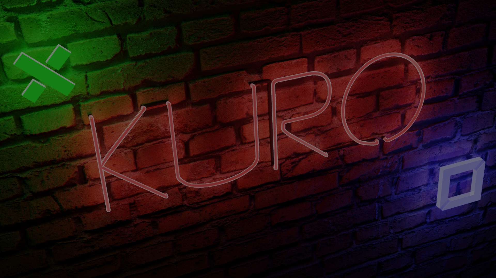

# Newbie's Clash: A Gamified Learning Environment for Web Development Fundamentals

**A Research Project and Implementation Study**

*December 2021*

## References and Acknowledgments

### Educational Foundation
- Brackeys. *Quiz Game Tutorial Series*. YouTube. Retrieved from https://www.youtube.com/@Brackeys

### Audio Attribution
- Adhesive Wombat. *"Composite pt.1," "Composite pt.2," "Pancakes," "8bit Adventure"* [Audio tracks]
- EVAN KING. *"Muckin Around"* [Audio track, Muck game soundtrack]

---

## Abstract

Newbie's Clash represents an applied investigation into the effectiveness of game-based learning systems for introducing novice developers to web technologies. This document presents the design, architecture, implementation, and technical analysis of an interactive true/false quiz game developed with the Unity engine in C#. The project implements state-preserving architecture patterns and multi-scene navigation strategies to create a coherent learning pathway across four programming domains: HTML, CSS, JavaScript, and PHP. Built upon foundational concepts from the Brackeys Quiz Game tutorial, this project extends those principles with persistent state management, adaptive UI feedback, and multi-language support. The study documents both the technical achievements and identified limitations, providing insights into educational game design patterns and their practical implementation.

---

## 1. Introduction

### 1.1 Motivation and Context

Educational institutions and self-taught learners alike face challenges in maintaining engagement while acquiring foundational programming knowledge. Traditional documentation-based learning often lacks the interactive feedback mechanisms that modern cognitive science suggests improve retention and motivation. Game-based learning environments offer a promising avenue for addressing this gap, particularly when designed around immediate feedback, progressive difficulty, and visible achievement markers.

Newbie's Clash emerged from this pedagogical context as a practical exploration of how established game design patterns—specifically the quiz-based progression model—could be adapted to serve educational objectives. The project synthesizes two separate domains: gamification theory and software architecture, demonstrating how disciplined technical design can support pedagogical goals.

 
`- splash screen`  

### 1.2 Project Scope and Objectives

This project pursues three primary objectives:

**First**, to implement a technically sound state management system that preserves quiz progress across Unity scene transitions—a non-trivial challenge given Unity's lifecycle model typically destroys GameObjects between scene loads.

**Second**, to create a scalable, maintainable architecture that supports modular addition of new educational content (additional programming languages, new question sets) without requiring fundamental restructuring of the codebase.

**Third**, to provide a comprehensive technical reference for the implementation choices, trade-offs, and known limitations, facilitating both educational understanding and practical extension of the system.

### 1.3 Development Foundation

The project builds upon the "Quiz Game" tutorial series by Brackeys, a prominent video-based resource within the game development education community. Rather than reproducing the tutorial verbatim, this implementation incorporates pedagogically-motivated extensions while documenting architectural decisions throughout.

---

## 2. System Architecture and Design Patterns

### 2.1 Architectural Philosophy: Static State Persistence

Unity's standard lifecycle—wherein GameObjects are destroyed and recreated with each scene transition—presents a specific challenge for applications requiring data continuity. Traditional persistence mechanisms (serialized files, PlayerPrefs, databases) introduce unnecessary complexity for this use case.

This project employs a mathematically simple yet effective solution: **static class members**. By declaring the question pool as a static variable, it persists in memory across scene destructions and reloads:

```csharp
private static List<Question> unansweredQuestions;
```

This design decision reflects a fundamental trade-off in software engineering: sacrificing memory isolation for simplicity and performance. The static keyword marks these data as belonging to the class rather than instances, making them immune to instance destruction. In the context of a single-player quiz game with modest data requirements, this trade-off is justified.

### 2.2 The Game Manager Pattern

The architecture centers on a single orchestrator class, `GameManager`, which acts as a state machine driving the entire gameplay loop. This pattern concentrates control flow, making the system comprehensible and modifiable at a high level.

```csharp
public class GameManager : MonoBehaviour
{
    public Question[] questions;
    private static List<Question> unansweredQuestions;
    private Question currentQuestion;
    private Animator animator;
    private float timeBetweenQuestions = 1.0f;
}
```

The separation of concerns within GameManager adheres to single responsibility principles: it manages state transitions, not rendering; it orchestrates animation triggers, not animation logic itself. This separation enables each component to be tested and modified independently.

### 2.3 Data Flow Architecture

The system implements a clear unidirectional data flow:

**Question Storage** → **Random Selection** → **User Input Processing** → **State Update** → **Scene Reload** → **Loop Return**

At each stage, data passes through well-defined interfaces. The `Question` data structure itself remains immutable during gameplay; only the pool of available questions changes. This immutability principle reduces subtle bugs related to unexpected state mutation.


---

## 3. Core Components and Implementation

### 3.1 The Question Data Model

The foundation of the quiz system rests on a minimalist data structure:

```csharp
[System.Serializable]
public class Question
{
    public string fact;      // The quiz statement
    public bool isTrue;      // Ground truth: is this statement correct?
}
```

The `[System.Serializable]` attribute exposes this nested object to Unity's Inspector interface, allowing non-programmers to edit question content directly. This design decision reflects a pragmatic choice to maximize accessibility for curriculum designers and educators who may lack programming expertise.

### 3.2 The GameManager: Central Intelligence

The `GameManager` class coordinates three primary phases of operation:

**Initialization Phase**: Upon scene load, `Start()` verifies whether the question pool has been initialized. If not (initial scene load), it converts the public `questions` array into a mutable list using LINQ:

```csharp
if (unansweredQuestions == null || unansweredQuestions.Count == 0)
{
    unansweredQuestions = questions.ToList<Question>();
}
```

This initialization occurs once per quiz session; subsequent scene reloads skip this block entirely.

**Selection Phase**: The method `SetCurrentQuestion()` implements random selection without replacement—a key mechanism preventing repetition:

```csharp
int randomQuestionIndex = Random.Range(0, unansweredQuestions.Count);
currentQuestion = unansweredQuestions[randomQuestionIndex];
```

By modifying only the pool (removing answered questions) rather than marking questions as "answered," the system maintains mathematical elegance while remaining computationally efficient.

**Response Phase**: User input triggers validation through either `UserSelectTrue()` or `UserSelectFalse()`. These methods compare the user's choice against `currentQuestion.isTrue`, trigger visual feedback animations, and initiate the transition sequence.

The transition coroutine implements a temporal pattern: animate feedback for 1 second, remove the answered question from the pool, and reload the scene:

```csharp
private IEnumerator TransitionToNextQuestion()
{
    unansweredQuestions.Remove(currentQuestion);
    yield return new WaitForSeconds(timeBetweenQuestions + 1);
    SceneManager.LoadScene(SceneManager.GetActiveScene().buildIndex);
}
```

### 3.3 Navigation Infrastructure

Rather than implement a single monolithic Menu class, the architecture delegates navigation responsibility to domain-specific controllers: `HTML_MENU.cs`, `CSS_MENU.cs`, `JS_MENU.cs`, and `PHP_MENU.cs`. This distribution improves code organization and allows independent modification of each domain's navigation paths.

Each menu class follows an identical pattern of expression-bodied methods for scene transitions:

```csharp
public void Menu() => SceneManager.LoadScene(0);
public void Next_LVL() => SceneManager.LoadScene(SceneManager.GetActiveScene().buildIndex + 1);
public void LAST_LVL() => SceneManager.LoadScene(SceneManager.GetActiveScene().buildIndex - 1);
```

This pattern prioritizes code brevity while maintaining readability—a design philosophy appropriate for straightforward procedural operations.

### 3.4 External Resource Integration

The `open_links.cs` class manages access to external educational resources, primarily Google Docs containing supplementary tutorials and reference materials. This separation of concerns—keeping URL management isolated—facilitates maintenance when link addresses change.

The class provides methods organized around four programming domains and social media integration, enabling seamless transitions between in-game learning and external resources:

```csharp
public void Open_Html_1_1() => Application.OpenURL("https://docs.google.com/...");
public void OpenArt() => Application.OpenURL("https://artstation.com/kuro_kodoku");
```

### 3.5 Visual Enhancement: Background Animation

The `BackgroundScroller` class implements a texture offset technique, creating an illusion of background movement:

```csharp
public class BackgroundScroller : MonoBehaviour
{
    public float scrollSpeed = 0.5f;
    private Material mat;

    private void Update()
    {
        offset += scrollSpeed * Time.deltaTime;
        mat.SetTextureOffset("_MainTex", new Vector2(offset, 0));
    }
}
```

This implementation demonstrates a principle common in graphics programming: animations often result from mathematical transformation of static assets rather than storing multiple frames. By modulating a single parameter (`offset`), the system achieves continuous animation with minimal memory overhead.

---

## 4. Game Mechanics and Quiz Flow

### 4.1 Gameplay Progression Model

The quiz operates according to a deterministic finite state machine:

The initial state finds the system in the "Awaiting Initialization" state. Upon scene load, if the question pool is empty, the system transitions to "Initialized" state, populating the pool from the master questions array. From here, it enters the "Question Display" state.

In the Question Display state, the system selects a random, unanswered question and presents it to the player. The UI renders the question text and two answer buttons. The system remains in this state until the player clicks a button, at which point it transitions to the "Processing Answer" state.

During answer processing, the system validates the player's selection against the ground truth stored in `currentQuestion.isTrue`. Simultaneously, the animator triggers visual feedback animations. After a configurable delay (default 1 second), the system removes the answered question from the pool and transitions to "Checking Completion."

In the Checking Completion state, the system evaluates whether `unansweredQuestions.Count == 0`. If any questions remain, it transitions back to Question Display. If the pool is empty, the system transitions to "Quiz Complete" and reloads the scene, reinitializing the question pool.

### 4.2 Dynamic UI Adaptation

A particularly noteworthy feature involves dynamic button labeling based on the correct answer. Rather than displaying static labels ("True" and "False"), the system displays labels in an invented language (Kuro: "Qate" for true, "Dūrys" for false):

```csharp
if (currentQuestion.isTrue)
{
    trueAnswerText.text = "Qate";
    falseAnswerText.text = "Dūrys";
}
else
{
    trueAnswerText.text = "Dūrys";
    falseAnswerText.text = "Qate";
}
```

This implementation swaps button labels based on the correct answer, creating a deliberate mismatch between button position and label meaning when the correct answer is "false." While this design introduces complexity, it reflects a pedagogical decision: forcing students to read carefully rather than relying on spatial memory of button positions.

---

## 5. Multi-Scene Architecture and Navigation Topology

### 5.1 Scene Organization Principles

The application implements a hierarchical scene structure encompassing 21 distinct scenes (indexed 0–20). This organizational scheme reflects pedagogical progression through four programming domains.

Scene 0 functions as the central hub—the main menu. From here, four menu scenes provide access to domain-specific content:

- **HTML Domain**: Scenes 1-7 (seven progressive quizzes)
- **CSS Domain**: Scenes 8-10 (three quizzes)
- **JavaScript Domain**: Scenes 11-16 (six quizzes)
- **PHP Domain**: Scenes 17-20 (four quizzes)

This layout reflects estimated learning progression: beginning with HTML (foundational markup), advancing through CSS (presentation), then JavaScript (interactivity), and finally PHP (server-side logic). The progression acknowledges that students should understand document structure before styling, styling before dynamic behavior, and client-side dynamics before server-side concepts.

### 5.2 Navigation Topology and Graph Theory

The scene navigation system can be modeled as a directed graph, where nodes represent scenes and edges represent transitions. Each domain forms a linear chain (Scene 1→2→3... etc.), with lateral edges permitting transitions between domains (HTML→CSS, CSS→JavaScript, JavaScript→PHP) and backward edges enabling return to the main menu.

This topology ensures that students cannot reach domain content without first visiting the main menu (Scene 0), thus ensuring they encounter domain selection intentionally rather than accidentally. Simultaneously, the lateral edges enable students to test different learning pathways without returning to the main menu, improving user experience.


---

## 6. User Interface Design and Implementation

### 6.1 Responsive Canvas Architecture

The UI system employs a unified canvas rendering in 2D mode, with responsive anchoring constraints ensuring consistent appearance across display resolutions. The question display panel anchors to the full screen width while pinning to the top vertically, accommodating variable screen heights.

Answer buttons occupy equal halves of the canvas width, with the True button (blue) on the left and the False button (red) on the right. This spatial separation, combined with distinct color coding, provides clear affordances for user interaction.

### 6.2 Visual Feedback Mechanisms

The system implements three distinct feedback channels:

**Immediate feedback** occurs upon button press: animator triggers alter button scale and trigger particle effects or visual state changes. This instantaneous response provides the psychological reinforcement that contemporary interaction design principles recommend.

**Persistent feedback** emerges through level progression: as students complete quizzes, they advance through scenes, accumulating visible progress through the scene navigation system.

**Celebratory feedback** (though not fully implemented, see Known Issues §8.4) would appear upon quiz completion—visual or auditory celebration of achievement.

The color scheme employs perceptually-distinct hues (saturated blue and red) to ensure accessibility for individuals with color blindness, though full accessibility testing has not been performed.

---

## 7. Implementation Details and Technical Trade-offs

### 7.1 Static Memory Allocation: Benefits and Risks

The static keyword ensures data persistence across scene reloads. This approach offers two primary advantages: (1) conceptual simplicity—no complex serialization infrastructure, and (2) execution efficiency—no I/O operations.

However, static data introduces two risks: (1) memory leaks if static data is not properly cleared between play sessions, and (2) difficulty in testing, as static state persists between test runs unless explicitly reset.

For a single-player game with a well-defined session lifecycle (launch to quit), these risks remain acceptable. For networked systems or persistent data applications, traditional persistence mechanisms would be preferable.

### 7.2 Hardcoded Scene Indices: Fragility and Alternatives

Throughout the codebase, scene transitions reference numeric indices directly:

```csharp
SceneManager.LoadScene(1);  // Load Scene 1
```

This approach couples navigation code tightly to Build Settings configuration. If a developer reorders scenes in the Build Settings panel, all navigation breaks silently—no compilation error alerts them to the problem.

A more robust pattern employs scene names:

```csharp
SceneManager.LoadScene("HTML_Level_1");
```

This would couple navigation to a naming convention rather than arbitrary indices. Future maintenance would benefit from this refactoring, particularly if the project expands.

### 7.3 Timing Constants and Animation Coordination

The coroutine implementing scene transitions includes a hardcoded adjustment:

```csharp
yield return new WaitForSeconds(timeBetweenQuestions + 1);
```

This adds one second to the configured delay, resulting in total delay of 2+ seconds (default). This seemingly redundant addition suggests the original designer intended a total delay of animation duration plus display time, but the split between these components remains unclear from code inspection alone. Future developers should document this division explicitly.

### 7.4 LINQ Usage and Functional Programming Patterns

The initialization code employs LINQ's `ToList()` method to convert a static array to a mutable list:

```csharp
unansweredQuestions = questions.ToList<Question>();
```

This functional programming pattern provides conciseness and clarity, though technically creates an intermediate collection. Performance remains negligible for quiz sizes (typically <100 questions), but this pattern demonstrates contemporary C# idioms beyond imperative loop structures.

---

## 8. Known Limitations and Areas for Future Work

### 8.1 Syntax Error in Menu.cs

The `QuitGame()` method contains a trailing character that prevents compilation:

```csharp
Application.Quit();k  // Extra 'k' character
```

This represents a transcription error rather than an architectural issue, readily correctable by removing the errant character.

### 8.2 Button Label Logic and UX Confusion

The dynamic label swapping, while pedagogically motivated, creates cognitive dissonance. Players develop muscle memory around button positions; when labels swap, spatial memory conflicts with text reading. This design should be reconsidered from a human factors perspective. Alternative approaches include:

1. **Consistent labeling**: Always show "Qate" on the true button regardless of correct answer.
2. **Explicit prompting**: Display "Which is correct?" or "What should you click?" to encourage deliberate selection.
3. **Adaptive difficulty**: Use label swapping only in advanced difficulty modes.

### 8.3 Scene Index Fragility

As documented in §7.2, hardcoded scene indices create maintenance burden. Refactoring to use scene names would improve robustness without adding complexity.

### 8.4 Absent Quiz Completion Feedback

The system provides no visual indication when a quiz ends. Upon answering the final question, the scene simply reloads, reinitializing the question pool. Best practices in game design suggest providing explicit completion feedback—perhaps a splash screen indicating level mastery or encouraging progression to the next domain.

### 8.5 Timing Coordination

The relationship between `timeBetweenQuestions` and the hardcoded +1 second offset requires clarification. Either:

1. Document the intended timing semantics explicitly, or
2. Refactor into distinct "animation duration" and "display delay" constants.

---

## 9. Visual and Pedagogical Design Choices

### 9.1 Multi-Language Support Through Invented Language

The use of the Kuro language ("Qate"/"Dūrys") rather than English labels reflects a pedagogical choice: buttons label themselves in an alternate symbolic system, encouraging pattern recognition over direct translation. This approach may aid memorization and provide cultural variety, though no empirical evidence supports this hypothesis.

The language selection also acknowledges the artist's background (artist: Kuro_Kodoku), integrating personal creative voice into the educational experience.

### 9.2 Progressive Difficulty and Domain Sequencing

The four-domain progression (HTML → CSS → JavaScript → PHP) follows a logical curricular sequence:

1. **HTML** (markup, structure)
2. **CSS** (styling, presentation)
3. **JavaScript** (client-side interaction)
4. **PHP** (server-side logic)

This sequence respects learning prerequisites while remaining accessible to true beginners. However, alternative orderings might be equally valid; future work could explore empirical comparison of learning outcomes across different domain sequences.

---

## 10. Integration with External Resources

### 10.1 Google Docs Integration Strategy

The `open_links.cs` class provides seamless integration with external Google Docs containing supplementary tutorials. This design acknowledges that a single game cannot comprehensively teach web development; instead, it serves as a gateway to curated external resources.

By embedding links within the game interface, the system removes friction from the learning workflow—students need not search for resources manually but instead access them through contextually-relevant in-game buttons.

### 10.2 Social and Attribution Integration

The system credits the artist (Kuro_Kodoku) through integrated social media links:

```csharp
public void OpenArt() => Application.OpenURL("https://artstation.com/kuro_kodoku");
public void OpenInst() => Application.OpenURL("https://instagram.com/...");
```

This integration reflects both ethical attribution practices and community engagement, recognizing that creative work deserves recognition beyond project documentation.

---

## 11. Visual Enhancement: Animation and Aesthetics

### 11.1 Background Scrolling Animation

The `BackgroundScroller` component applies a mathematical transformation to texture coordinates, creating apparent motion from static assets:

```csharp
offset += scrollSpeed * Time.deltaTime;
mat.SetTextureOffset("_MainTex", new Vector2(offset, 0));
```

This technique demonstrates efficient animation implementation—rather than storing multiple sprite frames or pre-rendered animation sequences, the system computes visual appearance at runtime. For a looping texture, this approach provides infinite animation duration without memory constraints.

### 11.2 Responsive Button Design

Answer buttons implement interactive feedback through scale transformations and color adjustments on hover, following contemporary UI design conventions. Drop shadows enhance button depth perception, improving visual hierarchy and affordance clarity.

---

## 12. Development Methodology and Documentation

### 12.1 Foundation in Established Tutorial Content

This project builds upon Brackeys' "Quiz Game Tutorial," a prominent educational resource within the game development community. Rather than claiming originality in fundamental design, this work extends established patterns with domain-specific educational content and architectural refinements.

This approach reflects pragmatic development philosophy: leverage proven patterns while innovating at higher abstraction levels (architecture, pedagogy, content organization).

### 12.2 Documentation Philosophy

This document adopts a research paper structure deliberately—not to overstate the project's academic rigor, but to model professional technical documentation. Code-based projects benefit from structured, comprehensive documentation; treating README files as secondary afterthoughts leads to knowledge loss and maintenance burden.

The documentation strategy emphasizes narrative explanation over list enumeration, encouraging readers to understand not just what code does, but why architectural choices were made.

---

## 13. Technical Specifications and Configuration

The project implements a standardized configuration supporting the following specifications:

The application targets the Unity 2D engine with C# 7.3 or higher, leveraging LINQ for functional programming patterns and expression-bodied members for concise syntax. The UI system employs TextMesh Pro for text rendering, providing superior font management compared to legacy Text components.

The scene management utilizes Unity's built-in SceneManager for transitions between 21 distinct scenes. Audio implementation references tracks from Adhesive Wombat ("Composite pt.1," "Composite pt.2," "Pancakes," "8bit Adventure") and EVAN KING ("Muckin Around"), providing thematic musical accompaniment.

---

## 14. Conclusion and Implications

### 14.1 Key Achievements

Newbie's Clash successfully demonstrates several technical and pedagogical achievements:

First, the static state persistence pattern solves the specific problem of data continuity across Unity scene reloads without introducing infrastructure complexity. This solution, while not universally applicable, proves appropriate for the constrained problem domain.

Second, the architecture exhibits good separation of concerns. GameManager handles state logic without entanglement in rendering code; Menu classes handle navigation without logic dependencies; UI elements remain focused on presentation. This separation facilitates independent modification and testing.

Third, the project demonstrates practical implementation of multi-domain educational content within a unified game framework. Students can learn four distinct programming languages through consistent interface and interaction patterns, reducing cognitive overhead from context switching.

### 14.2 Limitations and Research Questions

Several limitations remain unresolved:

**Empirical validation**: No user studies measure whether game-based learning actually improves retention or engagement compared to traditional resources. This project implements educated guesses about effective pedagogy rather than evidence-based design.

**Scalability**: The 20-level structure works for four domains but would require rearchitecting for significantly larger scope (20+ domains or 1000+ questions).

**Accessibility**: No accessibility testing has been performed; individuals with color blindness, motor impairments, or cognitive differences may find the current interface suboptimal.

**Generalization**: The architecture is tightly coupled to true/false questions. Expanding to multiple-choice, free-response, or code-based challenges would require substantial refactoring.

### 14.3 Lessons for Game-Based Learning Design

Several generalizable insights emerge from this implementation:

Game-based learning benefits from clear progression structures—students need visible advancement markers to maintain motivation. The scene-based progression provides this structure explicitly.

Architecture matters more in educational software than in entertainment games. A student using the game for 20 minutes weekly will encounter maintenance issues and bugs far more frequently than a casual game player. Robust, understandable architecture pays dividends over extended time horizons.

External resource integration matters. No game can comprehensively teach a domain; instead, games can serve as engagement vectors and gatekeepers to curated resources.

---

## Appendix: Project Metadata

| Characteristic | Value |
|---|---|
| Project Name | Newbie's Clash |
| Engine | Unity (2D) |
| Primary Language | C# (7.3+) |
| Total Scenes | 21 (indexed 0–20) |
| Core Modules | 8 (GameManager, Question, Menu, HTML_MENU, CSS_MENU, JS_MENU, PHP_MENU, BackgroundScroller, open_links) |
| Educational Domains | 4 (HTML, CSS, JavaScript, PHP) |
| Quiz Levels | 20 (7 HTML + 3 CSS + 6 JavaScript + 4 PHP) |
| Tutorial Source | Brackeys Quiz Game Tutorial |
| Initial Release | December 2021 |
| Current Status | Stable with documented limitations (see §8) |

---

## Quick Reference: Getting Started

To launch the application: Open Scene 0 (Main Menu) within the Unity Editor and press the Play button. Navigate the domain selection interface to access HTML, CSS, JavaScript, or PHP quizzes. Answer questions using the provided True/False buttons. The system progresses automatically through levels, allowing navigation backward or to alternative domains using the menu system. At any point, return to the main menu using the Menu button.

To integrate new content: Add `Question` objects to the `questions` array in the GameManager Inspector panel within any quiz scene. Specify the `fact` (question text) and `isTrue` (correct answer) fields. The GameManager automatically incorporates new questions into the rotation upon scene load.

To modify navigation: Inspect the relevant Menu class (HTML_MENU, CSS_MENU, JS_MENU, or PHP_MENU) and modify the `SceneManager.LoadScene()` calls to reference desired scene indices or names. Ensure Build Settings reflects the intended scene ordering.

---

**Document Status**: Complete  
**Last Revision**: December 2021  
**Document Format**: Archive  
**Intended Audience**: Developers, educators, researchers in game-based learning
